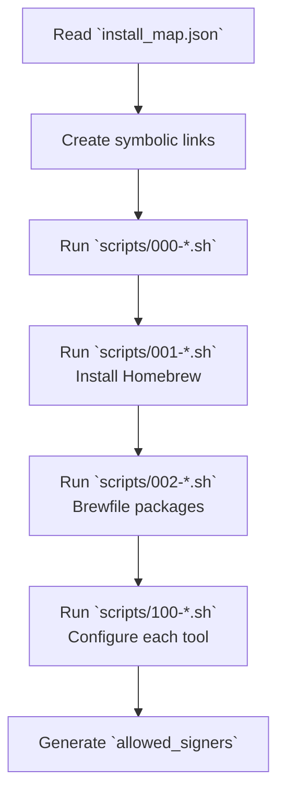

# Installation

This page explains how `install.sh` works and how to run it.

## Prerequisites

| Platform            | Requirements                                                       |
| ------------------- | ------------------------------------------------------------------ |
| macOS               | None in particular (`git` and `python3` are available by default) |
| Ubuntu (Codespaces) | `build-essential`, `git` (`000-codespace.sh` installs them automatically) |

## How to run

```bash
cd ~/.dotfiles
bash install.sh
```

## Processing flow

`install.sh` performs the following steps in order.



### 1. Create symbolic links

It parses `install_map.json` with Python3 and, for each entry:

1. Creates the destination parent directory with `mkdir -p` if it does not exist
2. If the parent directory is a symbolic link, converts it to a real directory (to support migration from older environments)
3. Removes any existing file or link
4. Creates a symbolic link from `dotfiles/<source>` to `<target>`

### 2. Run setup scripts

It runs the scripts under `scripts/` in filename order.

| Script             | Description                                                          |
| ------------------ | -------------------------------------------------------------------- |
| `000-codespace.sh` | Ubuntu-specific initial setup (time zone, default shell)            |
| `001-homebrew.sh`  | Installs Homebrew and updates gcc                                   |
| `002-brewfile.sh`  | Installs the packages defined in `Brewfile`                         |
| `100-*.sh`         | Per-tool setup (Ghostty, LazyVim, sheldon, mise, tmux, gh extension) |

Among the `100-*` scripts, those that depend on Homebrew (`ghostty`, `lazyvim`, `sheldon`) run sequentially, while the others run in parallel (maximum concurrency: the `DOTFILES_PARALLEL_JOBS` environment variable, default `3`).

### 3. Generate SSH `allowed_signers`

If global `user.email` and `~/.ssh/id_ed25519.pub` exist, it generates `~/.ssh/allowed_signers` for Git SSH signature verification.

## Re-running

`install.sh` is idempotent. No matter how many times you run it, it converges to the same state. Existing symbolic links are removed and then recreated.

## Environment variables

| Variable                 | Default | Description                          |
| ------------------------ | ------- | ------------------------------------ |
| `DOTFILES_PARALLEL_JOBS` | `3`     | Number of parallel `100-*` scripts |
