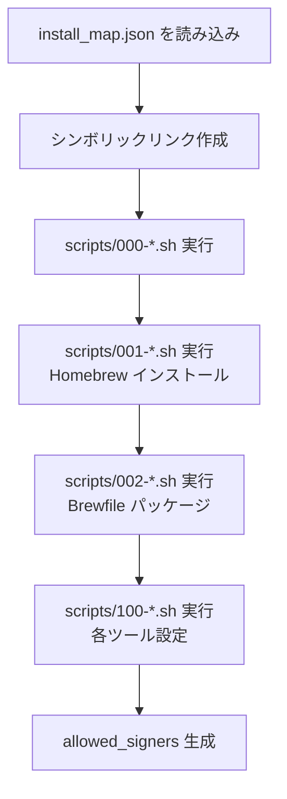

# インストール

`install.sh` の動作と実行方法を説明します。

## 前提条件

| プラットフォーム | 必要なもの |
|---|---|
| macOS | 特になし（`git` と `python3` はシステム標準で利用可能） |
| Ubuntu (Codespaces) | `build-essential`, `git`（`000-codespace.sh` が自動インストール） |

## 実行方法

```bash
cd ~/.dotfiles
bash install.sh
```

## 処理の流れ

`install.sh` は以下の順序で処理を行います。



### 1. シンボリックリンク作成

`install_map.json` を Python3 でパースし、各エントリについて:

1. 宛先の親ディレクトリが存在しなければ `mkdir -p` で作成
2. 親ディレクトリがシンボリックリンクの場合は実ディレクトリに変換（旧環境からの移行対応）
3. 既存のファイル/リンクがあれば削除
4. `dotfiles/<source>` → `<target>` のシンボリックリンクを作成

### 2. セットアップスクリプト実行

`scripts/` 以下のスクリプトをファイル名順に実行します。

| スクリプト | 内容 |
|---|---|
| `000-codespace.sh` | Ubuntu 固有の初期設定（タイムゾーン、デフォルトシェル） |
| `001-homebrew.sh` | Homebrew のインストールと gcc 更新 |
| `002-brewfile.sh` | `Brewfile` に定義されたパッケージのインストール |
| `100-*.sh` | 各ツール個別の設定（Ghostty, LazyVim, sheldon, mise, tmux, gh 拡張） |

`100-*` スクリプトのうち Homebrew に依存するもの（`ghostty`, `lazyvim`, `sheldon`）は逐次実行、それ以外は並列実行されます（最大並列数: `DOTFILES_PARALLEL_JOBS` 環境変数、デフォルト 3）。

### 3. SSH allowed_signers 生成

グローバル `user.email` と `~/.ssh/id_ed25519.pub` が存在する場合、Git の SSH 署名検証用 `~/.ssh/allowed_signers` を生成します。

## 再実行

`install.sh` は冪等です。何度実行しても同じ状態に収束します。既存のシンボリックリンクは削除してから再作成されます。

## 環境変数

| 変数 | デフォルト | 説明 |
|---|---|---|
| `DOTFILES_PARALLEL_JOBS` | `3` | `100-*` スクリプトの並列実行数 |
