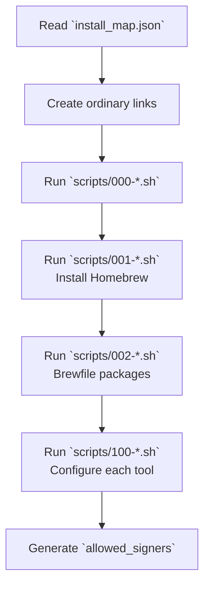

# Installation

This page explains how `install.sh` works and how to run it.

## Prerequisites

| Platform | Requirements |
| ------------------- | ------------------------------------------------------------------------- |
| macOS | None in particular (`git` and `python3` are available by default) |
| Ubuntu (Codespaces) | `build-essential`, `git` (`000-codespace.sh` installs them automatically) |

## How to run

```bash
cd ~/.dotfiles
bash install.sh
```

## Processing flow

`install.sh` performs the following steps in order.


```mermaid
graph TD
    A[Read `install_map.json`] --> B[Create ordinary links]
    B --> C[Run `scripts/000-*.sh`]
    C --> D[Run `scripts/001-*.sh`<br/>Install Homebrew]
    D --> E[Run `scripts/002-*.sh`<br/>Brewfile packages]
    E --> F[Run `scripts/100-*.sh`<br/>Configure each tool]
    F --> G[Generate `allowed_signers`]
```

### 1. Create symbolic links

The installer parses and type-checks `install_map.json` with Python3. Invalid
JSON or an unsupported value shape stops without changing existing links. For
each ordinary `links` entry, it then creates every declared destination:

1. Creates the destination parent directory with `mkdir -p` if it does not exist
2. If the parent directory is a valid symbolic link to a directory, converts it to a real directory to support migration from older environments
3. Removes any existing file or link
4. Creates a symbolic link from `dotfiles/<source>` to `<target>`

See [Adding and changing links](./03-managing-links.md) for procedures and
[`install_map.json`](../reference/install-map.md) for the full format.

### 2. Run setup scripts

It runs the scripts under `scripts/` in filename order.

| Script | Description |
| ------------------ | -------------------------------------------------------------------- |
| `000-codespace.sh` | Ubuntu-specific initial setup (time zone, default shell) |
| `001-homebrew.sh` | Installs Homebrew and updates gcc |
| `002-brewfile.sh` | Installs the packages defined in `Brewfile` |
| `003-vite-plus.sh` | Installs Vite+, managed Node.js LTS, and global Bun |
| `100-*.sh` | Per-tool setup (Ghostty, LazyVim, sheldon, mise, Vite+ project dependencies, herdr, gh extension) |

When `install.sh` runs these setup scripts, it sets `HOMEBREW_NO_ASK=1` for
their child processes. Homebrew updates and installations therefore continue
without `y/n` confirmation prompts; the update operation itself is not
disabled.

Among the `100-*` scripts, those that depend on Homebrew (`ghostty`, `lazyvim`, `sheldon`) run sequentially, while the others run in parallel (maximum concurrency: the `DOTFILES_PARALLEL_JOBS` environment variable, default `3`).

#### Herdr service updates

On macOS, the Herdr setup checks whether the running server is compatible with
the installed Homebrew client. A Homebrew upgrade can replace the client
binary while leaving the old server process alive. A different version remains
running when its protocol is compatible and the Homebrew service is healthy.
If the protocol is incompatible or the Homebrew service is unhealthy, the
setup stops the old service and default server, starts the current service,
and verifies the new server. Concurrent setup runs serialize this lifecycle;
the later run waits, rechecks the resulting state, and preserves a healthy
service instead of restarting it again.

Stopping a Herdr server terminates its panes, including an installer running in
one of them. When a handoff is required and `install.sh` is running inside
Herdr, the setup exits before changing the service. Save the pane work, open a
plain shell, and rerun `bash install.sh`. See the
[Herdr reference](../reference/herdr.md#server-lifecycle) for manual recovery.

### 3. Generate SSH `allowed_signers`

If global `user.email` and `~/.ssh/id_ed25519.pub` exist, it generates `~/.ssh/allowed_signers` for Git SSH signature verification.

## Refresh running applications

`install.sh` updates configuration links on disk, but it does not restart
applications that have already loaded those files. This matters for Ghostty
on macOS: the application process normally remains alive after its last window
closes, so launching another window can continue using the previous in-memory
configuration.

After installing or updating the dotfiles while Ghostty is running, press
`⌘⇧,` (Command+Shift+comma) to reload Ghostty, then create a new window or
tab. If the new surface still starts with the old behavior, quit Ghostty with
`⌘Q` and launch it again. See the [Ghostty reference](../reference/ghostty.md#reloading-after-configuration-changes) for verification commands and herdr-specific troubleshooting.

## Re-running

`install.sh` is idempotent for destinations still declared in the map. Existing
managed links are removed and recreated safely. It intentionally preserves
unrelated skill entries and does not remove destinations whose mapping or
canonical skill was deleted; remove those stale links manually.

## Environment variables

| Variable | Default | Description |
| ------------------------ | ------- | ---------------------------------- |
| `DOTFILES_PARALLEL_JOBS` | `3` | Number of parallel `100-*` scripts |
