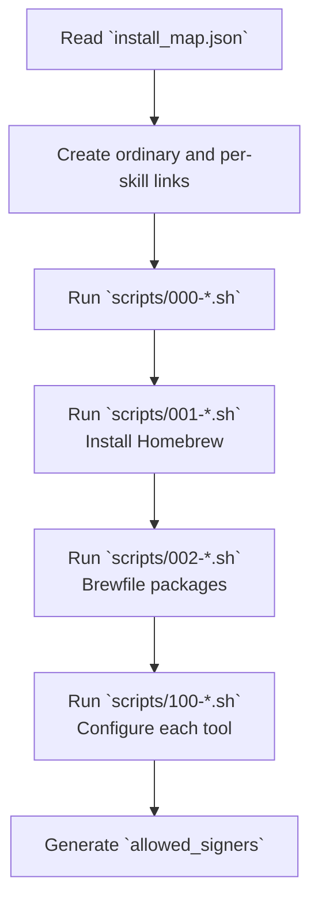

# Installation

This page explains how `install.sh` works and how to run it.

## Prerequisites

| Platform            | Requirements                                                              |
| ------------------- | ------------------------------------------------------------------------- |
| macOS               | None in particular (`git` and `python3` are available by default)         |
| Ubuntu (Codespaces) | `build-essential`, `git` (`000-codespace.sh` installs them automatically) |

## How to run

```bash
cd ~/.dotfiles
bash install.sh
```

## Processing flow

`install.sh` performs the following steps in order.


```mermaid
graph TD
    A[Read `install_map.json`] --> B[Create ordinary and per-skill links]
    B --> C[Run `scripts/000-*.sh`]
    C --> D[Run `scripts/001-*.sh`<br/>Install Homebrew]
    D --> E[Run `scripts/002-*.sh`<br/>Brewfile packages]
    E --> F[Run `scripts/100-*.sh`<br/>Configure each tool]
    F --> G[Generate `allowed_signers`]
```

### 1. Create symbolic links

The installer parses and type-checks all of `install_map.json` with Python3,
and materializes the ordinary links and skill destinations before making any
filesystem change. Invalid JSON or an unsupported value shape stops without
changing existing links. For each ordinary `links` entry, it then creates
every declared destination:

1. Creates the destination parent directory with `mkdir -p` if it does not exist
2. If the parent directory is a valid symbolic link to a directory, converts it to a real directory to support migration from older environments
3. Preserves symlinked `~/.copilot`, `~/.codex`, and `~/.claude` configuration roots instead of converting them; dangling links and links to non-directories stop without removing the link
4. Removes any existing file or link
5. Creates a symbolic link from `dotfiles/<source>` to `<target>`

It then finds direct children of `dotfiles/skills/` that contain `SKILL.md`
and links each one separately under every `skill_targets` directory. This
preserves unrelated built-in or independently installed skills in those
directories.

After all replacement links succeed, it removes the former whole-directory
`~/.copilot/skills` link only when that link resolves to this repository's
canonical skills source. A failure while installing ordinary or per-skill
links before that cleanup therefore leaves the legacy Copilot discovery path
intact. Failures in the later setup scripts occur after link migration has
finished and do not restore that legacy path.

See [Adding and changing links](./03-managing-links.md) for procedures and
[`install_map.json`](../reference/install-map.md) for the full format.

### 2. Run setup scripts

It runs the scripts under `scripts/` in filename order.

| Script             | Description                                                          |
| ------------------ | -------------------------------------------------------------------- |
| `000-codespace.sh` | Ubuntu-specific initial setup (time zone, default shell)             |
| `001-homebrew.sh`  | Installs Homebrew and updates gcc                                    |
| `002-brewfile.sh`  | Installs the packages defined in `Brewfile`                          |
| `100-*.sh`         | Per-tool setup (Ghostty, LazyVim, sheldon, mise, tmux, gh extension) |

Among the `100-*` scripts, those that depend on Homebrew (`ghostty`, `lazyvim`, `sheldon`) run sequentially, while the others run in parallel (maximum concurrency: the `DOTFILES_PARALLEL_JOBS` environment variable, default `3`).

### 3. Generate SSH `allowed_signers`

If global `user.email` and `~/.ssh/id_ed25519.pub` exist, it generates `~/.ssh/allowed_signers` for Git SSH signature verification.

## Re-running

`install.sh` is idempotent for destinations still declared in the map. Existing
managed links are removed and recreated safely. It intentionally preserves
unrelated skill entries and does not remove destinations whose mapping or
canonical skill was deleted; remove those stale links manually.

## Environment variables

| Variable                 | Default | Description                        |
| ------------------------ | ------- | ---------------------------------- |
| `DOTFILES_PARALLEL_JOBS` | `3`     | Number of parallel `100-*` scripts |
