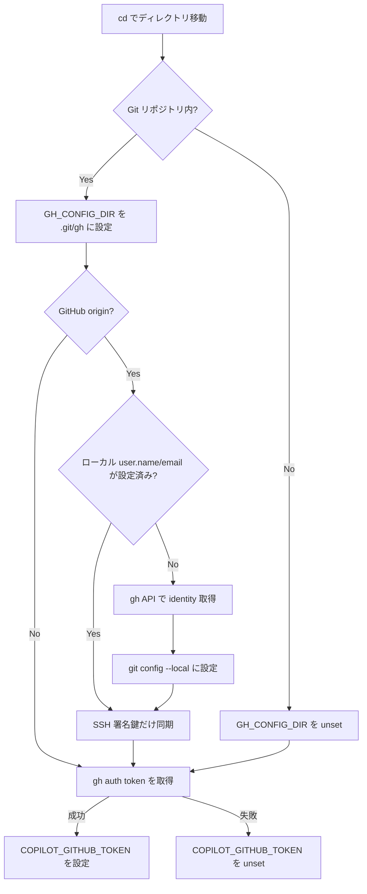

# Git ID の自動切り替え

リポジトリごとに GitHub アカウント（`user.name`, `user.email`, SSH 署名鍵）を自動で切り替える仕組みを説明します。

## 仕組み

`zsh/gh-config-dir.zsh` が zsh の `chpwd` フックに登録されており、ディレクトリ移動のたびに以下を実行します:



## 前提条件

- `gh auth login` で認証済みであること
- `gh` コマンドが `PATH` から実行できること
- SSH 鍵が `~/.ssh/<github-login>.pub` に配置されていること
- Copilot CLI (`copilot`) がインストール済みであること（Copilot CLI 切り替えを使う場合）

## 動作の詳細

### GH_CONFIG_DIR

すべての Git リポジトリで `.git/gh/` ディレクトリを作成し、`GH_CONFIG_DIR` 環境変数に設定します。これにより `gh` コマンドの認証情報がリポジトリ単位で分離されます。GitHub origin でないリポジトリでも `GH_CONFIG_DIR` は設定されますが、identity 同期（以下）は実行されません。

### Git identity の自動設定

1. `gh api user` で現在のアカウントの `login`, `name` を取得
2. `gh api user/emails` で primary email を取得
3. `git config --local user.name` / `user.email` に設定

### SSH 署名鍵の自動設定

1. `~/.ssh/<login>.pub` を `user.signingkey` に設定
2. `commit.gpgsign = true`, `gpg.format = ssh` をローカルに設定
3. `~/.ssh/allowed_signers` を更新（署名検証用）

### Copilot CLI アカウントの自動切り替え

`GH_CONFIG_DIR` を更新した後、`gh auth token` でトークンを取得して `COPILOT_GITHUB_TOKEN` に設定します。Copilot CLI はこの環境変数を保存済み認証情報より優先するため、`gh` と同じアカウントが使われます。

| 状況 | `GH_CONFIG_DIR` | `COPILOT_GITHUB_TOKEN` |
| ---- | --------------- | ---------------------- |
| 作業用リポジトリ（認証済み） | `.git/gh` | 作業アカウントのトークン |
| 個人リポジトリ（認証済み） | `.git/gh` | 個人アカウントのトークン |
| `gh` 未ログインのリポジトリ | `.git/gh` | unset（保存済みにフォールバック） |
| git リポジトリ外 | unset | グローバル `gh` アカウントのトークン |

## グローバル .gitconfig との関係

グローバル `~/.gitconfig` には `user.name` / `user.email` / `user.signingkey` を設定しません。すべてリポジトリローカルで管理するため、アカウントの混在を防げます。

グローバルには以下のような共通設定のみを記述します:

- `push.autosetupremote = true`
- `push.default = current`
- `commit.gpgsign = true`
- `gpg.format = ssh`
- `gpg.ssh.allowedSignersFile = ~/.ssh/allowed_signers`
- `pull.rebase = true`
- `rebase.autosquash = true`
- `core.quotepath = false`
- `init.defaultBranch = main`

`user.signingkey` もグローバルには設定しません。リポジトリ単位で適切な鍵が自動設定されます。

## トラブルシューティング

### identity が設定されない

```bash
# gh の認証状態を確認
gh auth status

# email スコープが必要な場合
gh auth refresh -h github.com -s user:email
```

### 署名鍵が見つからない

SSH 鍵のファイル名が `~/.ssh/<github-login>.pub` になっているか確認してください。

```bash
ls ~/.ssh/*.pub
gh api user --jq '.login'
```

### Copilot CLI のアカウントが切り替わらない

`COPILOT_GITHUB_TOKEN` が正しく設定されているか確認します。

```bash
# 現在の Copilot トークンの有無を確認
echo $COPILOT_GITHUB_TOKEN | cut -c1-10

# gh の認証状態を確認（GH_CONFIG_DIR が設定されていればリポジトリ固有の状態）
gh auth status
```

トークンが空の場合、そのリポジトリで `gh auth login` を実行してください。
