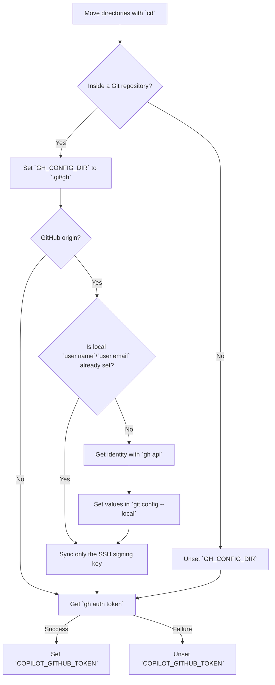

# Automatic Git ID switching

This page explains the mechanism that automatically switches the GitHub account (`user.name`, `user.email`, SSH signing key) for each repository.

## How it works

`zsh/gh-config-dir.zsh` is registered in the zsh `chpwd` hook, and every time you change directories it performs the following:



## Prerequisites

- You must already be authenticated with `gh auth login`
- The `gh` command must be executable from `PATH`
- Your SSH public key must be placed at `~/.ssh/<github-login>.pub`
- Copilot CLI (`copilot`) must already be installed (if you use Copilot CLI switching)

## Detailed behavior

### `GH_CONFIG_DIR`

It creates a `.git/gh/` directory in every Git repository and sets the `GH_CONFIG_DIR` environment variable to it. This isolates `gh` authentication data per repository. `GH_CONFIG_DIR` is also set for repositories whose origin is not GitHub, but identity synchronization (below) does not run for them.

### Automatic Git identity configuration

1. Gets the current account's `login` and `name` with `gh api user`
2. Gets the primary email with `gh api user/emails`
3. Sets them in `git config --local user.name` / `user.email`

### Automatic SSH signing key configuration

1. Sets `~/.ssh/<login>.pub` as `user.signingkey`
2. Sets `commit.gpgsign = true` and `gpg.format = ssh` locally
3. Updates `~/.ssh/allowed_signers` (for signature verification)

### Automatic Copilot CLI account switching

After updating `GH_CONFIG_DIR`, it gets a token with `gh auth token` and sets it in `COPILOT_GITHUB_TOKEN`. Copilot CLI gives this environment variable higher priority than stored credentials, so it uses the same account as `gh`.

| Situation | `GH_CONFIG_DIR` | `COPILOT_GITHUB_TOKEN` |
| ---- | --------------- | ---------------------- |
| Work repository (authenticated) | `.git/gh` | Work account token |
| Personal repository (authenticated) | `.git/gh` | Personal account token |
| Repository where `gh` is not logged in | `.git/gh` | unset (falls back to stored credentials) |
| Outside a Git repository | unset | Global `gh` account token |

## Relationship with global `.gitconfig`

The global `~/.gitconfig` does not set `user.name`, `user.email`, or `user.signingkey`. Because everything is managed locally per repository, you can avoid mixing accounts.

Only shared settings like the following are written globally:

- `push.autosetupremote = true`
- `push.default = current`
- `commit.gpgsign = true`
- `gpg.format = ssh`
- `gpg.ssh.allowedSignersFile = ~/.ssh/allowed_signers`
- `pull.rebase = true`
- `rebase.autosquash = true`
- `core.quotepath = false`
- `init.defaultBranch = main`

`user.signingkey` is also not set globally. The appropriate key is configured automatically for each repository.

## Troubleshooting

### Identity is not configured

```bash
# Check gh authentication status
gh auth status

# If the email scope is required
gh auth refresh -h github.com -s user:email
```

### Signing key cannot be found

Make sure the SSH key filename is `~/.ssh/<github-login>.pub`.

```bash
ls ~/.ssh/*.pub
gh api user --jq '.login'
```

### Copilot CLI account does not switch

Check whether `COPILOT_GITHUB_TOKEN` is set correctly.

```bash
# Check whether the current Copilot token is present
echo $COPILOT_GITHUB_TOKEN | cut -c1-10

# Check gh authentication status (repository-specific if GH_CONFIG_DIR is set)
gh auth status
```

If the token is empty, run `gh auth login` in that repository.
