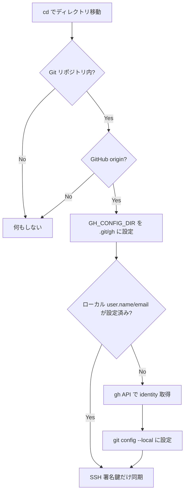

# Git ID の自動切り替え

リポジトリごとに GitHub アカウント（`user.name`, `user.email`, SSH 署名鍵）を自動で切り替える仕組みを説明します。

## 仕組み

`zsh/gh-config-dir.zsh` が zsh の `chpwd` フックに登録されており、ディレクトリ移動のたびに以下を実行します:



## 前提条件

- `gh auth login` で認証済みであること
- SSH 鍵が `~/.ssh/<github-login>.pub` に配置されていること

## 動作の詳細

### GH_CONFIG_DIR

リポジトリごとに `.git/gh/` ディレクトリを作成し、`GH_CONFIG_DIR` 環境変数に設定します。これにより `gh` コマンドの認証情報がリポジトリ単位で分離されます。

### Git identity の自動設定

1. `gh api user` で現在のアカウントの `login`, `name` を取得
2. `gh api user/emails` で primary email を取得
3. `git config --local user.name` / `user.email` に設定

### SSH 署名鍵の自動設定

1. `~/.ssh/<login>.pub` を `user.signingkey` に設定
2. `commit.gpgsign = true`, `gpg.format = ssh` をローカルに設定
3. `~/.ssh/allowed_signers` を更新（署名検証用）

## グローバル .gitconfig との関係

グローバル `~/.gitconfig` には `user.name` / `user.email` / `user.signingkey` を設定しません。すべてリポジトリローカルで管理するため、アカウントの混在を防げます。

グローバルには以下のような共通設定のみを記述します:

- `push.autosetupremote = true`
- `push.default = current`
- `commit.gpgsign = true`
- `gpg.format = ssh`
- `gpg.ssh.allowedSignersFile = ~/.ssh/allowed_signers`
- `pull.rebase = true`
- `rebase.autosquash = true`
- `core.quotepath = false`
- `init.defaultBranch = main`

`user.signingkey` もグローバルには設定しません。リポジトリ単位で適切な鍵が自動設定されます。

## トラブルシューティング

### identity が設定されない

```bash
# gh の認証状態を確認
gh auth status

# email スコープが必要な場合
gh auth refresh -h github.com -s user:email
```

### 署名鍵が見つからない

SSH 鍵のファイル名が `~/.ssh/<github-login>.pub` になっているか確認してください。

```bash
ls ~/.ssh/*.pub
gh api user --jq '.login'
```
