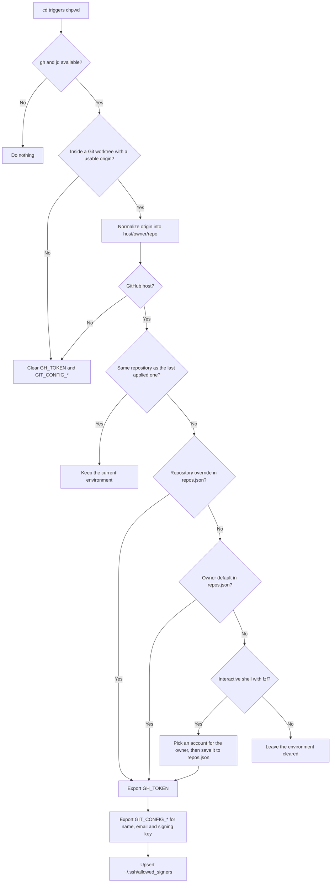

# Automatic Git ID switching

This page explains how the shell picks a GitHub account for the repository you
are in and applies that choice to `gh` and Git. Copilot authentication remains
an explicit parent-process setting.

## How it works

Every account stays in the GitHub CLI's single user-level configuration, which
can hold several accounts per host. A central mapping file records a default
account for each owner, with optional repository-specific overrides.

`dotfiles/zsh/gh-account.zsh` registers `gh-account-sync` on the zsh `chpwd`
hook and runs it once when the shell starts. On every directory change it
resolves the repository identity and applies the mapped account to the current
shell:


```mermaid
graph TD
    A["cd triggers chpwd"] --> B{"gh and jq available?"}
    B -- No --> Z["Do nothing"]
    B -- Yes --> C{"Inside a Git worktree with a usable origin?"}
    C -- No --> X["Clear GH_TOKEN and GIT_CONFIG_*"]
    C -- Yes --> D["Normalize origin into host/owner/repo"]
    D --> E{"GitHub host?"}
    E -- No --> X
    E -- Yes --> F{"Same repository as the last applied one?"}
    F -- Yes --> Y["Keep the current environment"]
    F -- No --> G{"Repository override in repos.json?"}
    G -- Yes --> H["Export GH_TOKEN"]
    G -- No --> O{"Owner default in repos.json?"}
    O -- Yes --> H
    O -- No --> K{"Interactive shell with fzf?"}
    K -- Yes --> L["Pick an account for the owner, then save it to repos.json"]
    K -- No --> M["Leave the environment cleared"]
    L --> H
    H --> I["Export GIT_CONFIG_* for name, email and signing key"]
    I --> J["Upsert ~/.ssh/allowed_signers"]
```

Nothing is written to `git config --local`, and `GH_CONFIG_DIR` is never set.
See [ADR 0029](../development/99-adr/0029-owner-default-gh-account-mapping.md) for
the GitHub CLI and Git identity design, and
[ADR 0025](../development/99-adr/0025-copilot-token-parent-context.md) for
the separate Copilot token policy.

## Prerequisites

- `gh`, `jq`, and `fzf` must be executable from `PATH` (all three come from the
  `Brewfile`)
- Every account you want to use must be logged in once with `gh-account-login`
  (a `gh auth login` wrapper, see [Commands](#commands))
- Your SSH public key must be placed at `~/.ssh/<login>.pub`, named after the
  GitHub login, for commit signing
- Copilot CLI (`copilot`) must already be installed, if you use Copilot CLI
  switching

## The account mapping file

The mapping lives next to gh's own configuration at
`~/.config/gh/repos.json` (`$XDG_CONFIG_HOME/gh/repos.json`), and
`GH_ACCOUNT_MAP_FILE` overrides that path.

Each key is a canonical, lowercase identity derived from `origin`:

- `<host>/<owner>` stores that owner's default account.
- `<host>/<owner>/<repo>` stores an explicit repository override.

The plugin looks for the repository key first, then the owner key. Each value
names the account to use:

```json
{
  "github.com/octocat": {
    "login": "octocat",
    "name": "The Octocat",
    "email": "octocat@users.noreply.github.com"
  },
  "github.com/acme-inc": {
    "login": "octocat-work",
    "name": "Octo Cat",
    "email": "octocat@acme.example.com"
  },
  "github.com/acme-inc/release-tools": {
    "login": "octocat-release",
    "name": "Release Octo Cat",
    "email": "release@acme.example.com"
  }
}
```

| Key form | Meaning |
| --- | --- |
| `<host>/<owner>` | Default account for every repository owned by `<owner>` on `<host>` |
| `<host>/<owner>/<repo>` | Explicit account override for one repository |

| Field | Description |
| --- | --- |
| `login` | GitHub login of a stored `gh` account, used to fetch its token |
| `name` | Value injected as `user.name` |
| `email` | Value injected as `user.email`, and the key of the `allowed_signers` entry |

The file is read and written with `jq` and replaced atomically, so a failed
write never truncates it. It holds no secrets — tokens stay in gh's own
configuration — so it is safe to inspect or edit by hand.

`origin` is normalized by `gh-account-repo-id`, which accepts `https://`,
`ssh://` (with or without a port), `git://`, and scp-like
`git@host:owner/repo` URLs, with or without a trailing `.git`, and lowercases
the result. All of those forms therefore share the same repository and owner
keys.

## Selecting an account

The first time you enter a GitHub repository without a repository override or
an owner default, the plugin opens an fzf picker listing the logins stored in
`gh`. Choosing one resolves the account's display name and primary email
through the API, saves an owner entry to `repos.json`, and applies it
immediately. Other repositories for that owner inherit the choice. Pressing
`ESC` cancels: nothing is saved and no account is applied, so the next `cd`
into a repository with no applicable mapping asks again.

> [!NOTE]
> The prompt appears only in interactive shells. Inside a zle widget, when
> stdin is not a tty, or when `TERM` is `dumb`, an unmapped repository is
> silently skipped, so scripts, CI, and editor shells never block on it.

Run `ghu` at any time to pick a different account for the current owner.
Run `ghu --repo` to make the current repository an explicit exception.

`ghu --forget` removes the current owner's default. If the current repository
has an override, that override remains effective. `ghu --repo --forget`
removes only the current repository's override and immediately falls back to
the owner default when one exists.

## What gets applied

### `GH_TOKEN`

The account's token is obtained with
`gh auth token --hostname <host> --user <login>` and exported as `GH_TOKEN`.
It is an ordinary shell variable, so two terminals sitting in repositories
owned by different accounts never interfere.

`GH_TOKEN` also reaches Git: the credential helper configured for
`https://github.com` is `!gh auth git-credential`, and it returns
`username=x-access-token` with that token as the password. `git push` and
`git fetch` therefore act as the selected account too — the token decides the
acting account, while `GIT_CONFIG_*` decides commit authorship.

### `COPILOT_GITHUB_TOKEN`

`gh-account.zsh` deliberately does not read, set, or clear
`COPILOT_GITHUB_TOKEN`. Set it in the parent process when a Copilot user must
be pinned. This repository does not rewrite or forward the variable; child
authentication is provided by the host's native subagent mechanism.

Never echo, commit, or place the token in a prompt. Check only whether it is
present, and configure it through your approved credential-management method.

### Git identity through `GIT_CONFIG_*`

The identity is injected as environment configuration rather than written to
disk, using `GIT_CONFIG_COUNT` with a `GIT_CONFIG_KEY_<n>` and
`GIT_CONFIG_VALUE_<n>` pair for each of:

- `user.name`
- `user.email`
- `user.signingkey` — `~/.ssh/<login>.pub`, added only when that file exists

Git gives these variables precedence over every configuration file, so a
repository that still carries `user.name` or `user.email` in
`git config --local` from the previous design resolves to the selected account
anyway, with no cleanup required. Verify the effective values at any time:

```bash
git config user.name
git config user.email
git config user.signingkey
```

### SSH signing verification

Whenever a signing key is applied, `~/.ssh/allowed_signers` is upserted for
that email: the existing line for the same email is replaced and every other
account's line is kept. Local verification with `git log --show-signature`
therefore keeps working across accounts.

### Summary

| Situation | `GH_TOKEN` | `COPILOT_GITHUB_TOKEN` | Injected `GIT_CONFIG_*` identity |
| --- | --- | --- | --- |
| Repository with an override | Token of the repository account | Unchanged | Name, email, and signing key |
| Repository with an owner default and no override | Token of the owner account | Unchanged | Name, email, and signing key |
| Repository without a mapping, interactive shell | Set after you pick an owner account | Unchanged | Set after you pick an account |
| Repository without a mapping, non-interactive | unset | Unchanged | unset |
| Repository whose `origin` is not GitHub | unset | Unchanged | unset |
| Outside Git, or without a usable `origin` | unset | Unchanged | unset |

## Commands

| Command | Purpose |
| --- | --- |
| `ghu` or `gh-account-select` | Pick the account for the current owner |
| `ghu --owner` | Explicitly pick the account for the current owner |
| `ghu --repo` | Pick an account override for the current repository |
| `ghu --forget` | Remove the current owner's default and re-resolve the current repository |
| `ghu --repo --forget` | Remove the current repository override and fall back to the owner default |
| `gh-account-login` | Run `gh auth login` without `GH_TOKEN`, to add or re-authenticate an account |
| `gh-account-cleanup-local` | Remove identity keys left in `git config --local` by the old design |
| `gh-account-sync` | Apply the effective mapping for the current directory; runs on `chpwd` and skips when the repository has not changed |
| `gh-account-map-get <id> <field>` | Read one field of a mapping entry |
| `gh-account-repo-id <url>` | Print the canonical `<host>/<owner>/<repo>` identity of a remote URL |

Use the repository key first and then its owner key when inspecting the
effective mapping manually:

```bash
repo_id="$(gh-account-repo-id "$(git remote get-url origin)")"
gh-account-map-get "$repo_id" login || gh-account-map-get "${repo_id%/*}" login
```

## Caveats

> [!IMPORTANT]
> `GH_TOKEN` masks the stored credentials for `gh auth login`,
> `gh auth logout`, `gh auth switch`, and `gh auth status`. To see or change
> the stored accounts, strip it first with `env -u GH_TOKEN gh auth status`, or
> use `gh-account-login` for logins. The plugin already does this for its own
> internal `gh` calls.

> [!WARNING]
> The account lives in the shell environment, so shells that are already open
> keep whatever they resolved earlier. After changing a mapping elsewhere, open
> a new shell or `cd` out and back in to re-trigger `chpwd`.

## Relationship with global `.gitconfig`

The global `~/.gitconfig` does not set `user.name`, `user.email`, or
`user.signingkey`. Those three keys come from the selected account, so accounts
cannot be mixed by accident.

Only shared settings like the following are written globally:

- `push.autosetupremote = true`
- `push.default = current`
- `commit.gpgsign = true`
- `gpg.format = ssh`
- `gpg.ssh.allowedSignersFile = ~/.ssh/allowed_signers`
- `pull.rebase = true`
- `rebase.autosquash = true`
- `core.quotepath = false`
- `init.defaultBranch = main`
- `credential.https://github.com.helper = !gh auth git-credential`

Because signing is enabled globally while the key comes from the account, only
the three identity keys need injecting for the current shell. The credential
helper is global for the same reason: it resolves to whichever account
`GH_TOKEN` currently names.

## Troubleshooting

### Identity is not configured

Check the repository override and then the owner default, then re-select if
needed.

```bash
repo_id="$(gh-account-repo-id "$(git remote get-url origin)")"
gh-account-map-get "$repo_id" login || gh-account-map-get "${repo_id%/*}" login
ghu
```

If selecting an account reports that no email could be resolved, the token may
lack the email scope.

```bash
env -u GH_TOKEN gh auth refresh -h github.com -s user:email
```

### `gh auth status` shows the wrong account

That is the `GH_TOKEN` mask. Ask gh about its stored accounts explicitly.

```bash
env -u GH_TOKEN gh auth status
```

### Legacy per-repository Git settings are still around

The previous design wrote identity into `git config --local` and kept a `gh`
configuration directory per repository. The injected `GIT_CONFIG_*` values win,
so nothing breaks, but the leftovers can be removed.

```bash
gh-account-cleanup-local
```

Old per-repository `gh` configuration directories are no longer read at all.
Log in once per account with `gh-account-login` to populate gh's user-level
configuration instead.

### Signing key cannot be found

Make sure the SSH key filename matches the GitHub login.

```bash
ls ~/.ssh/*.pub
repo_id="$(gh-account-repo-id "$(git remote get-url origin)")"
gh-account-map-get "$repo_id" login || gh-account-map-get "${repo_id%/*}" login
```
